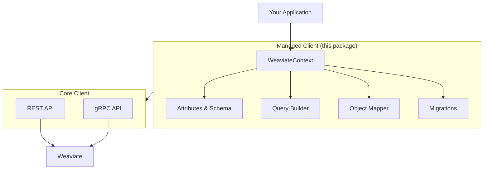

<div align="center">

# Weaviate C# Managed Client

### The Entity Framework experience for [Weaviate](https://weaviate.io).

Define collections with attributes. Query with LINQ. Migrate schemas safely. **Ship faster.**

<br/>

[](https://github.com/weaviate/csharp-client-managed/actions/workflows/main.yaml)
[](https://www.nuget.org/packages/Weaviate.Client.Managed)
[](https://www.nuget.org/packages/Weaviate.Client.Managed)
[](https://dotnet.microsoft.com/)
[](https://weaviate.io/)
[](LICENSE)

</div>

<br/>

```csharp
// 1. Define your model
[WeaviateCollection("Articles")]
public class Article
{
    [WeaviateUUID] public Guid Id { get; set; }
    [Property] public string Title { get; set; } = "";
    [Property] public string Content { get; set; } = "";
    [Vector<Vectorizer.Text2VecOpenAI>] public float[]? Embedding { get; set; }
}

// 2. Create a context (just like EF Core's DbContext)
public class BlogContext : WeaviateContext
{
    public BlogContext(WeaviateClient client) : base(client) { }
    public CollectionSet<Article> Articles { get; set; } = null!;
}

// 3. Use it
var context = new BlogContext(client);
await context.Migrate<Article>();
await context.Insert(new Article { Title = "Hello Weaviate", Content = "Vector databases are amazing." });

var results = await context.Articles.Query()
    .Where(a => a.Title.Contains("Weaviate"))
    .NearText("vector database tutorial")
    .Limit(10);

foreach (var r in results)
    Console.WriteLine($"{r.Object.Title} (score: {r.Metadata.Score})");
```

> [!TIP]
> **Want low-level API access?** Check out the [core Weaviate C# client](https://github.com/weaviate/weaviate-dotnet-client) for direct REST/gRPC operations.

---

## Why Use the Managed Client?

| | Feature | What You Get |
|---|---|---|
| **Schema** | Attribute-Driven | Define collections with `[WeaviateCollection]`, `[Property]`, `[Vector<T>]` — like EF Core |
| **Queries** | Type-Safe | LINQ-style `.Where()`, `.NearText()`, `.Hybrid()` with compile-time safety |
| **Mapping** | Zero Boilerplate | Automatic C# ↔ Weaviate mapping, camelCase conversion, vector handling |
| **Migrations** | Safe by Default | Schema evolution with breaking change detection — blocks destructive changes |
| **RAG** | Built-In | `.Generate().SinglePrompt()` for retrieval-augmented generation |
| **DI** | One Line | `services.AddWeaviateContext<T>()` for ASP.NET Core integration |
| **Vectors** | 47+ Vectorizers | OpenAI, Cohere, HuggingFace, Ollama, and more — configured via attributes |
| **Multi-Tenancy** | Native | `.ForTenant("acme")` scoping with immutable cloning |

---

## Installation

```bash
dotnet add package Weaviate.Client.Managed
```

---

## Feature Showcase

### Attribute-Driven Schema Definition

Your C# classes _are_ your schema. No YAML, no JSON, no separate config files.

```csharp
[WeaviateCollection(Name = "Product", Description = "Product catalog")]
public record Product
{
    [WeaviateUUID]
    public Guid Id { get; set; }

    [Property(Description = "Product name")]
    [Index(Searchable = true, Filterable = true)]
    [Tokenization(PropertyTokenization.Word)]
    public string Name { get; set; } = "";

    [Property(DataType.Number)]
    [Index(Filterable = true, RangeFilters = true)]
    public decimal Price { get; set; }

    [Property]
    [NestedType(typeof(ProductSpecs))]
    public ProductSpecs? Specs { get; set; }

    [Vector<Vectorizer.Text2VecOpenAI>(VectorIndexType = typeof(VectorIndex.Hnsw))]
    public float[]? Embedding { get; set; }

    [Reference(Loading = Loading.Eager)]
    public Category? Category { get; set; }
}
```

### Type-Safe Queries

Semantic search, keyword search, hybrid search, and filtering — all with IntelliSense.

```csharp
// Semantic search with filters
var products = await context.Products.Query()
    .Where(p => p.Price < 100 && p.Category.Name == "Electronics")
    .NearText("wireless headphones")
    .WithReferences()
    .Limit(10);

// Hybrid search (combines BM25 + vector)
var results = await context.Products.Query()
    .Hybrid("laptop", alpha: 0.7)
    .OrderByScore();

// BM25 keyword search
var exact = await context.Products.Query()
    .BM25(query: "USB-C charger")
    .WithMetadata(MetadataOptions.Score);
```

### Query Projections

Return only the fields you need — with automatic metadata injection.

```csharp
[QueryProjection<Product>]
public class ProductSummary
{
    public string Name { get; set; } = "";
    public decimal Price { get; set; }

    [MetadataProperty(MetadataField.Score)]
    public float? Score { get; set; }
}

var summaries = await context.Query<ProductSummary>()
    .NearText("best value laptop")
    .Limit(5);
```

### Query Lifecycle Hooks (`ConfigureSearch`)

Define default query behavior directly on your entity or projection — no repetition at every call site.

```csharp
// Entity-level defaults: apply to every query on this collection
[WeaviateCollection("Products")]
public class Product
{
    [Property] public string Name { get; set; } = "";
    [Property] public bool IsActive { get; set; }

    // Automatically applied unless overridden
    public static void ConfigureSearch(QueryConfig<Product> q) =>
        q.Where(p => p.IsActive).Limit(50u);
}

// Projection-level: overrides entity defaults when this projection is used
[QueryProjection<Product>]
public class ProductSummary
{
    public string Name { get; set; } = "";

    public static void ConfigureSearch(QueryConfig<Product> q) =>
        q.Where(p => p.IsActive).Limit(10u);  // tighter limit for summaries
}

// Explicit call always wins — overrides both entity and projection hooks
var results = await context.Products.Query<ProductSummary>()
    .Limit(27u)    // takes precedence over ProductSummary.ConfigureSearch
    .Execute();
```

**Precedence:** explicit call > projection's `ConfigureSearch` > entity's `ConfigureSearch`.

### Aggregations

Compute statistics across a collection with a typed projection — mean, sum, min, max, count, and grouping.

```csharp
[QueryAggregate<Product>]
public class ProductStats
{
    [Metrics(Metric.Number.Mean, Metric.Number.Sum, Metric.Number.Count, Metric.Number.Min, Metric.Number.Max)]
    public Aggregate.Number Price { get; set; }

    [Metrics(Metric.Integer.Mean, Metric.Integer.Sum)]
    public Aggregate.Integer Stock { get; set; }
}

// Aggregate over all objects
var stats = await context.Aggregate<ProductStats>();
Console.WriteLine($"Avg price: {stats.Properties.PriceMean:C}, Total: {stats.TotalCount}");

// Filter before aggregating
var inStockStats = await context.Aggregate<ProductStats>()
    .Where(p => p.InStock)
    .Execute();

// Group by a property
var byCategory = await context.Aggregate<ProductStats>()
    .GroupBy("category")
    .Execute();

foreach (var group in byCategory.Groups)
    Console.WriteLine($"{group.GroupedBy.Value}: avg {group.Properties.PriceMean:C}");
```

You can also extract single metrics to scalar properties instead of using full `Aggregate.*` types:

```csharp
[QueryAggregate<Product>]
public class SimpleStats
{
    [Metrics("price", Metric.Number.Mean)]
    public double? AveragePrice { get; set; }

    [Metrics("price", Metric.Number.Count)]
    public long? PriceCount { get; set; }

    [Metrics("stock", Metric.Integer.Sum)]
    public long? TotalStock { get; set; }
}

var stats = await context.Aggregate<SimpleStats>();
Console.WriteLine($"Average: ${stats.AveragePrice:F2}, Total stock: {stats.TotalStock}");
```

### Safe Migrations

Schema changes are analyzed before execution. Breaking changes are blocked by default.

```csharp
// Single collection migration
var plan = await context.PlanMigration<Product>();

if (plan.HasBreakingChanges)
    Console.WriteLine($"Breaking changes: {plan.BreakingChanges.Count}");

// Safe changes apply automatically; breaking changes require explicit opt-in
await context.Migrate<Product>(allowBreakingChanges: false);

// Migrate ALL collections in the context at once
await context.Migrate();  // Migrates all registered collections

// Check pending migrations across all collections
var pendingMigrations = await context.GetPendingMigrations();
foreach (var (collectionName, migrationPlan) in pendingMigrations)
    Console.WriteLine($"{collectionName}: {migrationPlan.Changes.Count} changes");

// Advanced: migrate all + delete orphaned collections
await context.Migrate(allowBreakingChanges: false, destructive: true);
```

### RAG (Retrieval-Augmented Generation)

First-class generative AI support with 15+ providers.

```csharp
[WeaviateCollection("Documents")]
[Generative<Generative.OpenAI>]
public class Document
{
    [Property] public string Content { get; set; } = "";
}

var response = await context.Documents.Query()
    .NearText("climate change")
    .Limit(5)
    .Generate()
    .SinglePrompt("Summarize in 3 sentences.")
    .Execute();

Console.WriteLine(response.GeneratedText);
```

### Cross-References

Model relationships between collections with eager or explicit loading.

```csharp
[WeaviateCollection("ProductReview")]
public record ProductReview
{
    [Property] public string Title { get; set; } = "";
    [Property] public double Rating { get; set; }

    [Reference]
    public Product? Product { get; set; }
}

// Query with references expanded
var reviews = await context.Reviews.Query()
    .Where(r => r.Rating >= 4.0)
    .WithReferences()
    .Limit(10);

// Access the referenced product directly
var productName = reviews.First().Object.Product?.Name;
```

### Batch Operations

Insert across multiple collections in a single unit of work.

```csharp
var batch = context.Batch();
batch.Add(product1, product2, product3);
batch.Add(review1, review2);
await batch.Execute(); // Topologically sorted, cross-collection
```

### Dependency Injection

One-line setup for ASP.NET Core applications.

```csharp
// In Program.cs
services.AddWeaviateLocal();
services.AddWeaviateContext<ProductCatalogContext>(
    options => { options.AutoMigrate = true; },
    eagerMigration: true
);

// In your service — just inject it
public class ProductService(ProductCatalogContext context)
{
    public async Task<IEnumerable<Product>> Search(string query)
        => (await context.Products.Query().NearText(query).Limit(10)).Objects();
}
```

---

## Full-Stack Example

> [!NOTE]
> **Ready-to-run ASP.NET Core Web API** — Complete product catalog with semantic search, filtering, pagination, reviews with cross-references, and automatic data seeding.
>
> [`src/Example/WebApi/`](src/Example/WebApi/) — Swagger UI, health checks, CORS for SvelteKit, and DI-wired `WeaviateContext`.

Additional console examples covering traditional usage, dependency injection patterns, and multi-client setups are in [`src/Example/`](src/Example/).

---

## Managed Client vs Core Client

| | Managed Client _(this package)_ | Core Client |
|---|---|---|
| **Best for** | Apps with domain models | Dynamic schemas, low-level control |
| **Schema** | C# attributes on classes | Manual API calls |
| **Queries** | LINQ-style fluent builder | Direct gRPC/REST calls |
| **Mapping** | Automatic (both directions) | Manual serialization |
| **Migrations** | Built-in with safety checks | N/A |
| **Learning curve** | Familiar to EF Core developers | Requires Weaviate API knowledge |

Both packages can be used together — the managed client is built on top of the core client, and you can always drop down to the core API when needed.

---

## Architecture



---

## Compatibility

| Managed Client | Weaviate | .NET |
|---|---|---|
| Latest | 1.31 — 1.34+ | 8.0, 9.0 |

Tested in CI against Weaviate **1.31.20**, **1.32.17**, **1.33.5**, and **1.34.0**.

---

## Documentation

| | Guide | Description |
|---|---|---|
| :rocket: | **[Getting Started](docs/GETTING_STARTED.md)** | 5-minute quickstart |
| :book: | **[User Guide](docs/GUIDE.md)** | Comprehensive usage patterns |
| :label: | **[Attributes Reference](docs/ATTRIBUTES.md)** | All 16+ attributes explained |
| :mag: | **[API Reference](docs/API_REFERENCE.md)** | Complete API surface |
| :arrows_counterclockwise: | **[Migrations](docs/MIGRATIONS.md)** | Schema evolution strategies |
| :building_construction: | **[Architecture](docs/ARCHITECTURE.md)** | System design deep-dive |
| :dart: | **[Advanced Patterns](docs/ADVANCED.md)** | Multi-tenancy, multi-vector, RAG |
| :syringe: | **[Dependency Injection](docs/DEPENDENCY_INJECTION.md)** | ASP.NET Core integration |
| :trophy: | **[Best Practices](docs/BEST_PRACTICES.md)** | Production guidelines |

---

## Development

### Running Tests

```bash
# Start local Weaviate (requires >= 1.31.0)
./ci/start_weaviate.sh            # defaults to 1.31.0
./ci/start_weaviate.sh 1.34.0     # or specify a version

# Run all tests
dotnet test

# Managed client tests only
dotnet test src/Weaviate.Client.Managed.Tests/

# Exclude slow tests (backups, replication)
dotnet test --filter "Category!=Slow"

# Stop Weaviate
./ci/stop_weaviate.sh
```

### Code Formatting

This project uses [CSharpier](https://csharpier.com/) for consistent formatting:

```bash
# Manual formatting
dotnet csharpier .          # format all files
dotnet csharpier --check .  # check only (no changes)
```

#### Pre-Commit Hooks (Recommended)

Automatically format code before each commit using [pre-commit](https://pre-commit.com/):

```bash
# One-time setup (requires Python/pip)
pip install pre-commit  # or: brew install pre-commit

# Install hooks in your local .git/hooks/
pre-commit install

# Now CSharpier runs automatically on git commit!
# Or run manually on all files:
pre-commit run --all-files
```

The hook formats only staged C# files, keeping commits clean and consistent.

---

## Community & Support

- **[Weaviate Forum](https://forum.weaviate.io/)** — Questions and discussions
- **[Weaviate Slack](https://weaviate.io/slack)** — Live chat with the community
- **[GitHub Issues](https://github.com/weaviate/csharp-client-managed/issues)** — Bug reports and feature requests
- **[Email](mailto:devex@weaviate.io)** — devex@weaviate.io

If you find this project useful, give it a :star: — it helps others discover it!

---

## License

BSD-3-Clause — see [LICENSE](LICENSE) for details.

---

## Related Projects

- **[Weaviate](https://github.com/weaviate/weaviate)** — The AI-native vector database
- **[Weaviate C# Client](https://github.com/weaviate/weaviate-dotnet-client)** — Core REST/gRPC client
- **[Weaviate Documentation](https://weaviate.io/developers/weaviate)** — Official docs

---

<div align="center">

**Made with :heart: by [Weaviate](https://weaviate.io)**

[Website](https://weaviate.io) · [Documentation](https://weaviate.io/developers/weaviate) · [Blog](https://weaviate.io/blog)

</div>
