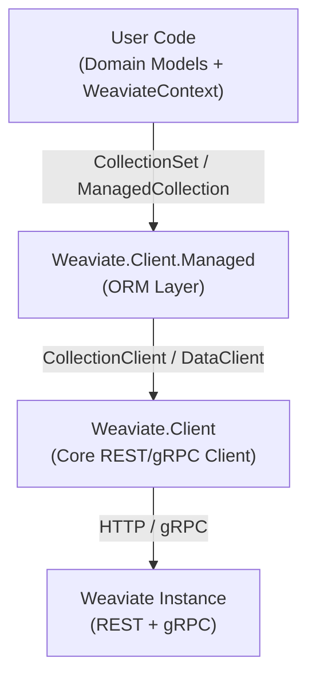
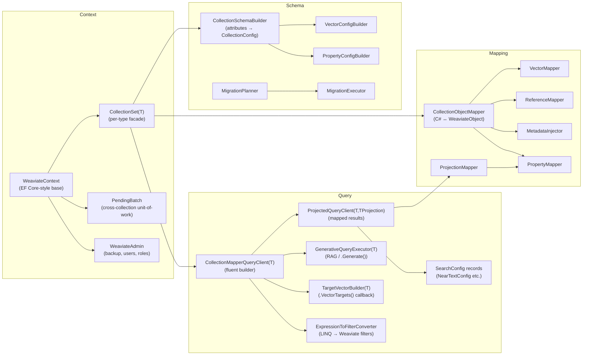
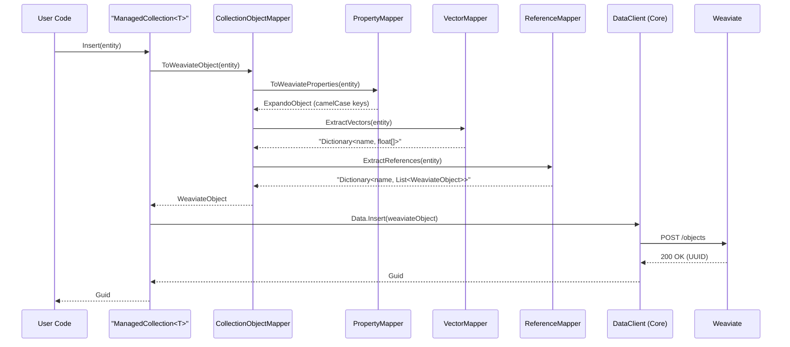
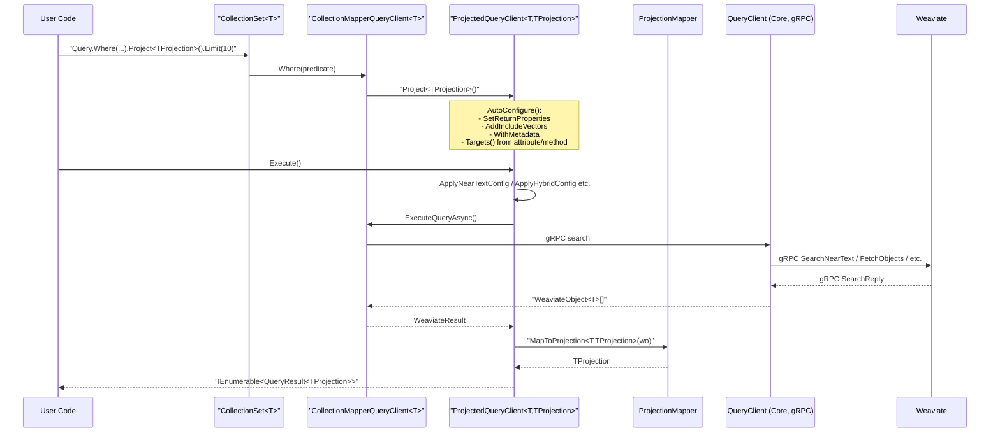
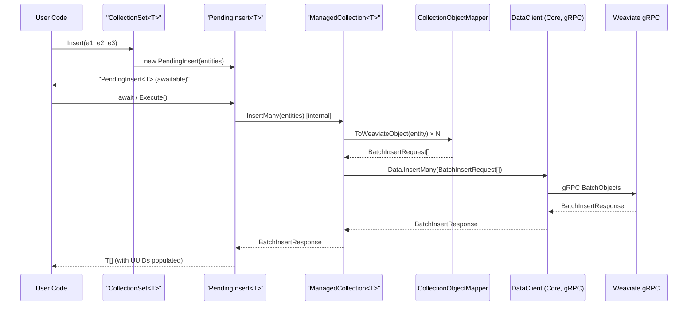
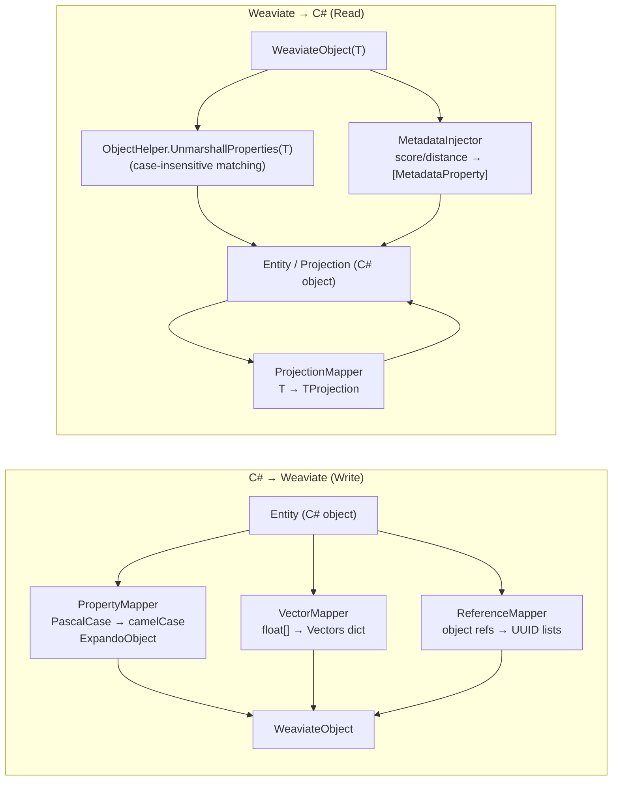
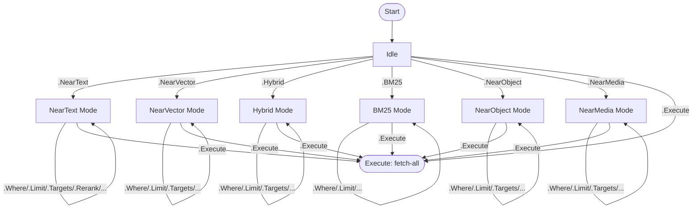

# Weaviate.Client.Managed — Architecture Overview

## 1. Architecture Layers

## 2. Component Map

## 3. Key Data Flows

### Insert (single object, REST path)

### Query with Projection

### Insert (batch via PendingInsert)

## 4. Attribute System

All attributes live in `Weaviate.Client.Managed.Attributes/`.

### Entity-level (on collection classes)

| Attribute | Purpose |
|-----------|---------|
| `[WeaviateCollection]` | Collection name, lifecycle hooks, multi-tenancy, sharding, replication |
| `[WeaviateUUID]` | Marks a `Guid` property as the entity's UUID |
| `[Property(DataType)]` | Property definition with type, name override, description |
| `[Index]` | Filterable / Searchable / RangeFilters flags |
| `[Tokenization]` | Text tokenization strategy |
| `[Vector<TVectorizer>]` | Named vector with vectorizer config (generic, 47+ vectorizers) |
| `[VectorIndex<TIndexConfig>]` | HNSW / Flat / Dynamic index |
| `[Quantizer*]` | BQ / PQ / SQ / RQ vector quantization |
| `[Reference]` | Cross-reference; target inferred from property type; `Target=` required for `Guid?` |
| `[Generative<TModule>]` | RAG module config |
| `[Reranker<TModule>]` | Reranker config |

### Projection-level (on projection classes)

| Attribute | Purpose |
|-----------|---------|
| `[QueryProjection<TCollection>]` | Marks a class as a query projection; `Combination` for multi-vector |
| `[QueryAggregate<T>]` | Marks a class as an aggregation projection |
| `[MapFrom("SourceName")]` | Maps a projection property from a differently-named source property |
| `[Vector]` | Includes a named vector in projection results; `Weight` for ManualWeights |
| `[Reference]` | Includes a reference in projection results; `SourceProperty` override |
| `[MetadataProperty]` | Injects query metadata (score, distance, etc.) |

### Convention-based static methods on projection classes

| Method | Signature | Purpose |
|--------|-----------|---------|
| `ConfigureNearText` | `static NearTextConfig ConfigureNearText(NearTextConfig)` | Default NearText settings |
| `ConfigureNearVector` | `static NearVectorConfig ConfigureNearVector(NearVectorConfig)` | Default NearVector settings |
| `ConfigureHybrid` | `static HybridConfig ConfigureHybrid(HybridConfig)` | Default Hybrid settings |
| `ConfigureNearObject` | `static NearObjectConfig ConfigureNearObject(NearObjectConfig)` | Default NearObject settings |
| `ConfigureNearMedia` | `static NearMediaConfig ConfigureNearMedia(NearMediaConfig)` | Default NearMedia settings |
| `ConfigureVectorTargets` | `static TargetVectorBuilder<TCollection> ConfigureVectorTargets(TargetVectorBuilder<TCollection>)` | Multi-vector targeting (takes precedence over `Combination` attribute) |

### Convention-based static methods on entity and projection classes

| Method | Signature | Scope | Precedence | Purpose |
|--------|-----------|-------|------------|----------|
| `ConfigureSearch` | `static void ConfigureSearch(QueryConfig<T>)` | Entity or Projection | Query > Projection > Entity | Apply query options (Where, Limit, Offset, OrderBy, etc.) |

**Precedence rules** (highest to lowest):
1. **Explicit query calls**: `.Limit(27)` always takes precedence
2. **Projection-level**: `ConfigureSearch` on projection class overrides entity defaults
3. **Entity-level**: `ConfigureSearch` on entity class provides base defaults

## 5. Feature Summary

| Feature | Entry point | Notes |
|---------|-------------|-------|
| **Schema creation** | `client.Collections.CreateFromClass<T>()` | Reads attributes, creates collection |
| **Schema migration** | `collection.Migrate()` | Compares live schema to attribute spec; blocks breaking changes by default |
| **Insert (single)** | `await context.Insert(entity)` | REST path; returns entity with UUID |
| **Insert (batch)** | `await context.Insert(e1, e2, e3)` | gRPC path; returns `PendingInsert<T>` (directly awaitable) |
| **Update** | `collection.Update(entity, id)` | Partial update (PATCH) |
| **Replace** | `collection.Replace(entity, id)` | Full replace (PUT) |
| **Delete (single/batch)** | `await context.Delete(e1, e2, e3)` | Returns `PendingDelete<T>` (directly awaitable); uses `Filter.UUID.ContainsAny` |
| **Query (typed)** | `collection.Query()` | Returns `IEnumerable<QueryResult<T>>` (`.Execute()` optional) |
| **Query (projected)** | `collection.Query<TProjection>()` | Maps results to projection type (`.Execute()` optional) |
| **Query (generative/RAG)** | `.Generate(...)` | Returns `GenerativeQueryResponse<T>` (`.Execute()` optional) |
| **Query (grouped)** | `.GroupBy(p => p.Property, groups, perGroup)` | Returns `GroupByQueryExecutor<T>` (directly awaitable) → `GroupByQueryResponse<T>` |
| **Aggregate** | `collection.Aggregate.WithMetrics<TResult>()` | Typed aggregate results (`.Execute()` optional) |
| **Aggregate (grouped)** | `.GroupBy(p => p.Property)` | Returns `GroupedAggregateBuilder<T,TResult>` (directly awaitable) |
| **Multi-vector targeting** | `.Targets(t => t.Sum(...))` | Combines named vectors |
| **Batch (cross-collection)** | `context.Batch().Execute()` | Topological-sort ordering |
| **References** | `[Reference]` on property | Eager/Explicit loading; target inferred from type |
| **Multi-tenancy** | `collection.WithTenant("tenant")` | Per-tenant scoping |
| **Dependency Injection** | `services.AddWeaviateContext<TContext>()` | Registers context + eager migration option |
| **Roslyn Analyzer** | `Weaviate.Client.Managed.Analyzers` | Compile-time validation of attribute usage |

## 6. Mapping Architecture

## 7. Query Builder State Machine

`CollectionMapperQueryClient<T>` tracks search mode and accumulates parameters:

